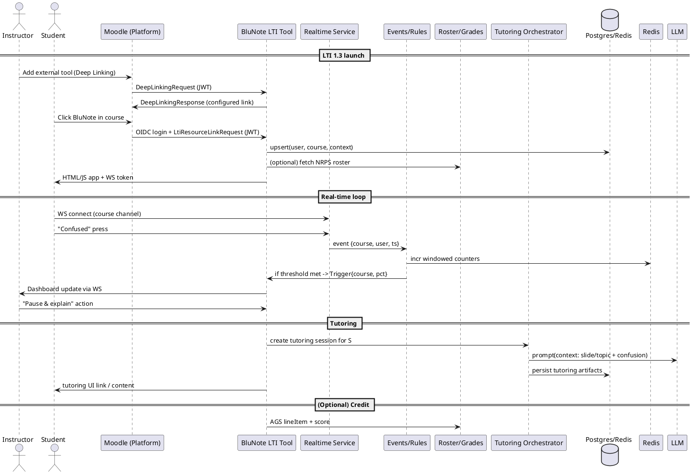

# SPEC-1-LTI Plugin

## Method

### High-level architecture
- **Moodle (LMS) → BluNote LTI Tool (your SaaS)**
  - LTI 1.3 OIDC login + JWT launch to identify user, role, course, context.
  - Optional Deep Linking for instructors to add/configure the tool; NRPS to fetch roster (for % threshold); AGS to optionally pass participation credit.
- **Real-time plane**
  - Browser connects to WebSocket gateway; server publishes events via Redis Pub/Sub; lecturer dashboard and students receive live updates (<200 ms).
- **AI tutoring**
  - Post-trigger, students who pressed “Confused” get a BluNote tutoring panel (in the BluNote web app or mobile app) driven by an external LLM API; topic context comes from slide/topic metadata and confusion logs.

### Components (deployable services)
- **Gateway API (REST)** — LTI endpoints (OIDC login, launch, Deep Linking), session creation, token minting.
- **Realtime Service** — WebSocket server; channels per course/session.
- **Events/Rules Service** — windowed counters, threshold detection, debouncing, anonymity logic.
- **Tutoring Orchestrator** — builds prompts from topic + confusion context; calls LLM; stores artifacts.
- **Roster/Grades Adapter** — NRPS pulls active enrollments; AGS posts pass/fail credits (optional).
- **Admin & Dashboard UI** — instructor view, course config, analytics.
- **Data Store** — Postgres (OLTP), Redis (counters/ephemeral), S3-compatible object store (artifacts).

### Launch & realtime sequence
1. Instructor adds tool via Deep Linking.
2. Student launches tool via OIDC login (JWT).
3. BluNote records user/course/context and optional roster.
4. Student connects to WebSocket.
5. Student presses “Confused” → Event to Rules Service.
6. Rules Service applies threshold logic, updates dashboard in real-time.
7. If triggered, Tutoring Orchestrator creates tutoring session → LLM generates targeted explanations.
8. (Optional) Participation credit posted back to LMS via AGS.

### Threshold & debouncing logic
- Maintain rolling window **W = 120 s** per course/session.
- Debounce per user (**d = 20 s**).
- Active denominator = roster active in W.
- Confusion % = unique confused users in W / active denominator * 100.
- Trigger if % ≥ threshold (**default 25%**). Reset after cooldown (**3 min**).

### Data model (Postgres)
```sql
institutions, deployments, courses, users, enrollments
lectures, confusion_events, triggers, actions
tutoring_sessions, tutoring_artifacts, grade_items, grades
```

### Config & rules (per course)
- **Threshold %**, **window W**, **debounce d**, **cooldown C**.
- **Anonymity**: default on, optional off.
- **Participation credit** via AGS lineItem.

### Security & privacy
- **LTI 1.3 security model** (OIDC + OAuth2) for launch & services.
- **PII minimization**: email hashed, aggregates shown by default.
- **Retention policies & audit logs** per institution.

### PlantUML (architecture sequence simplified)

